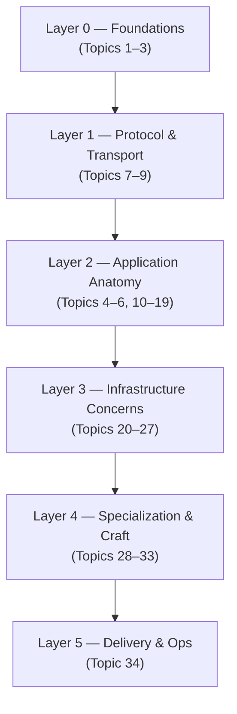

# Understanding [SystemDesign.md](file:///e:/XCoding/Asp.net/proj/Developements/SystemDesign.md)

## What Is This Document?

A **complete backend & system design curriculum** structured from Beginner → Intermediate → Expert, covering **34 topics** across **6 layers**. It's designed as a learning roadmap for backend engineers and system designers.

---

## Structure at a Glance

---

## Layer-by-Layer Breakdown

### Layer 0 — Foundations (The "physics" of software)

| # | Topic | Key Takeaway |
|---|-------|-------------|
| 1 | **System Design** | CAP theorem, scaling, trade-offs, distributed system patterns |
| 2 | **Operating Systems** | Processes, threads, I/O models, memory management |
| 3 | **Computer Networks** | TCP/IP, DNS, TLS, HTTP versions, QUIC |

### Layer 1 — Protocol & Transport (How data moves)

| # | Topic | Key Takeaway |
|---|-------|-------------|
| 7 | **HTTP Protocol** | Methods, status codes, HTTP/2 & HTTP/3, caching headers |
| 8 | **Routing** | URL routing, trie-based routers, versioning |
| 9 | **Serialization** | JSON, Protobuf, Avro, schema evolution |

### Layer 2 — Application Anatomy (How apps are built)

| # | Topic | Key Takeaway |
|---|-------|-------------|
| 4 | **Backend Development** | Layered architecture, DI, Clean Architecture, DDD |
| 5 | **DBMS** | ACID, indexing, MVCC, query optimization |
| 6 | **Security** | CIA triad, OWASP, Zero Trust, OAuth/OIDC |
| 10 | **Auth & AuthZ** | JWT, OAuth 2.0, RBAC/ABAC, token rotation |
| 11 | **Validation** | Schema-driven validation, boundary validation |
| 12 | **Middleware** | Request pipeline, cross-cutting concerns |
| 13 | **Request Context** | Request-scoped data, trace propagation |
| 14 | **Handlers/Controllers** | Thin controllers, CQRS, MediatR |
| 15 | **CRUD** | Pagination, upserts, idempotent writes |
| 16 | **REST Best Practices** | Resource-oriented design, versioning, RFC 7807 |
| 17 | **Databases (Practical)** | SQL vs NoSQL choices, ORM, migrations |
| 18 | **Business Logic Layer** | DDD aggregates, domain events, bounded contexts |
| 19 | **Caching** | Cache-aside, write-through, Redis patterns, stampede prevention |

### Layer 3 — Infrastructure Concerns (Operating at scale)

| # | Topic | Key Takeaway |
|---|-------|-------------|
| 20 | **Transactional Emails** | SPF/DKIM/DMARC, async delivery, idempotency |
| 21 | **Task Queuing** | Kafka vs RabbitMQ, DLQ, transactional outbox |
| 22 | **Elasticsearch** | Inverted index, aggregations, cluster architecture |
| 23 | **Config Management** | 12-Factor, secrets, feature flags |
| 24 | **Logging & Observability** | Logs/Metrics/Traces pillars, SLIs/SLOs |
| 25 | **Graceful Shutdown** | SIGTERM handling, connection draining |
| 26 | **Scaling & Performance** | Horizontal scaling, Amdahl's Law, backpressure |
| 27 | **Concurrency** | Async/await, locks, actors model, CSP |

### Layer 4 — Specialization & Craft

| # | Topic | Key Takeaway |
|---|-------|-------------|
| 28 | **Object Storage** | S3/presigned URLs, multipart upload |
| 29 | **Realtime Systems** | WebSocket, SSE, Pub/Sub, CRDTs |
| 30 | **Testing & Quality** | Test pyramid, TDD, chaos engineering |
| 31 | **12-Factor App** | 12 principles + 3 extensions for cloud-native |
| 32 | **OpenAPI Standard** | API-first development, spec-driven testing |
| 33 | **Webhooks** | HMAC signing, at-least-once delivery |

### Layer 5 — Delivery & Ops

| # | Topic | Key Takeaway |
|---|-------|-------------|
| 34 | **DevOps** | CI/CD, Docker, Kubernetes, GitOps, chaos engineering |

---

## Learning Progression

| Phase | Timeline | Focus | Milestone |
|-------|----------|-------|-----------|
| **Beginner** | Months 1–3 | OS, Networks, HTTP, SQL, CRUD, JWT, Docker | Build a CRUD REST API with JWT + PostgreSQL + Docker |
| **Intermediate** | Months 4–8 | Middleware, caching, queues, monitoring, testing | Production-grade API with CI/CD pipeline |
| **Advanced** | Months 9–18 | System Design, Elasticsearch, WebSockets, DDD, K8s | Design & build a distributed system from scratch |
| **Expert** | 18+ months | Distributed theory, chaos engineering, mentoring | Contribute to open source infra |

---

## 5 Cross-Cutting Meta-Principles

1. **Fail gracefully** — errors are expected; unhandled errors are bugs
2. **Observability first** — if you can't measure it, you can't improve it
3. **Stateless where possible** — the foundation of scale
4. **Security is a constraint, not a feature** — bolt-on security always fails
5. **Test your assumptions** — benchmarks and chaos tests reveal truth

---

## How Each Topic Is Structured

Every topic follows the same format:
- **Core Concepts** — fundamental definitions
- **Subtopics** — progressive depth (Beginner → Intermediate → Expert)
- **Real-World Use Cases** — practical application examples
- **Key Principles** — distilled wisdom
- **Common Pitfalls** — what goes wrong
- **Connections** — links to other topics in the map
